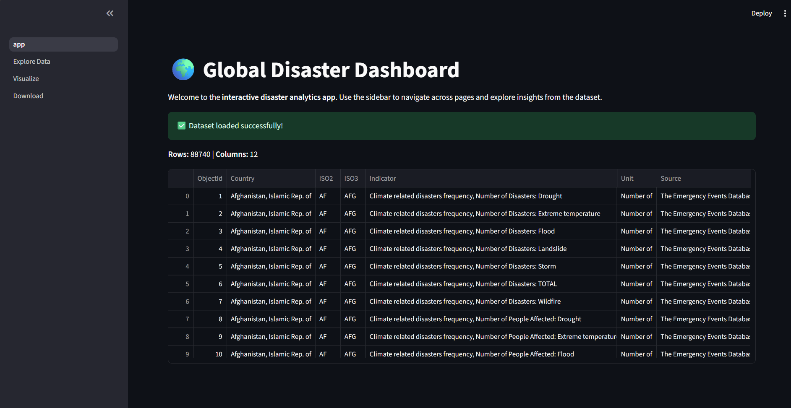
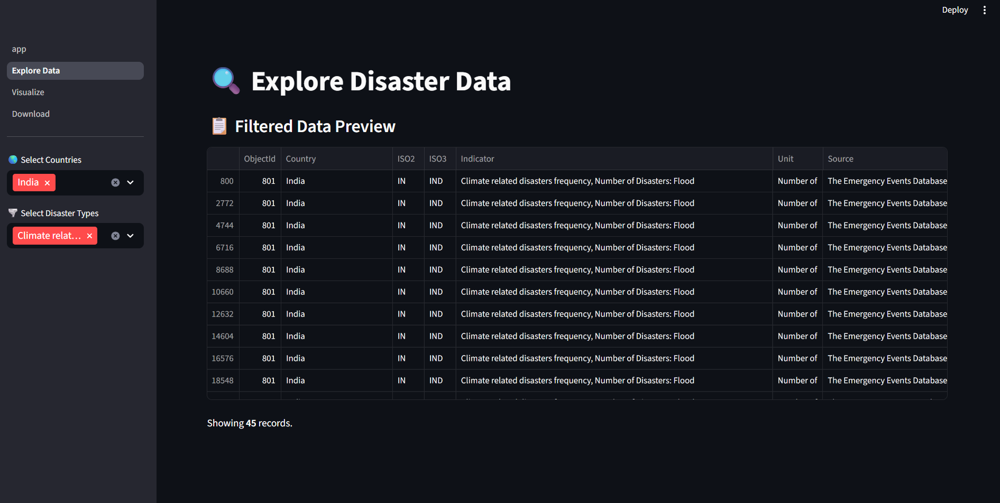
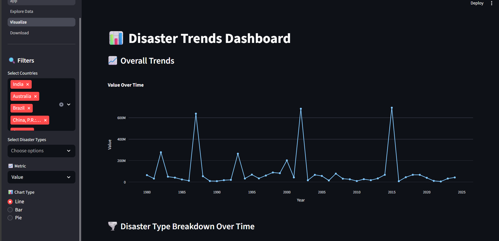
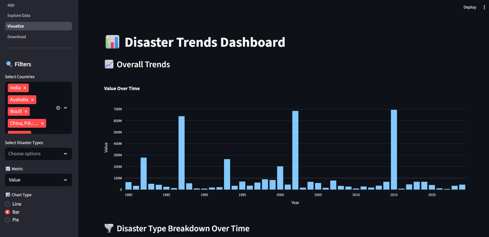
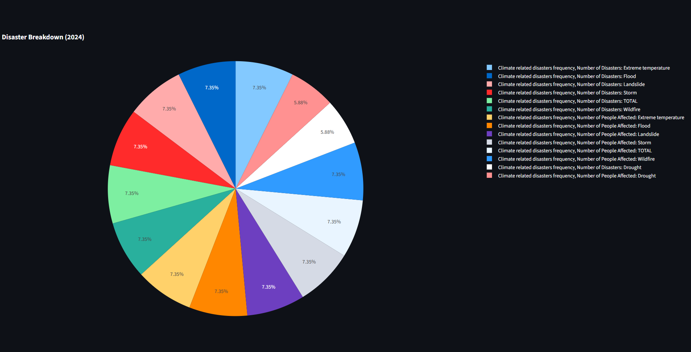

🌍 Disaster Trends Dashboard

A professional Streamlit-based web application for exploring and visualizing global disaster datasets (1980–2024).

This app allows users to:
✅ Upload or use the provided Disasters.csv dataset
✅ Explore data with filters (country, indicator, disaster type, years)
✅ Visualize disaster trends over time (line, bar, pie, area charts)
✅ Download filtered datasets

🚀 Features

Interactive UI built with Streamlit

Dynamic filtering (countries, years, disaster types, indicators)

Visualizations with Plotly:

Line charts for time series

Bar & Pie charts for category breakdowns

Area charts for disaster-type trends

Downloadable results in CSV format

Dockerized deployment for easy setup

📂 Project Structure
disasters_app/
│── app.py                     # Main entry point (homepage)
│── utils.py                   # Data loading & helper functions
│── Disasters.csv              # Sample dataset
│── pages/
│   ├── 1_Explore_Data.py       # Explore dataset
│   ├── 2_Visualize.py          # Data visualization
│   ├── 3_Download.py           # Export filtered data
│── .streamlit/
│   └── config.toml             # Streamlit theme & settings
│── Dockerfile                  # Docker build file
│── docker-compose.yml          # Docker compose setup
│── README.md                   # Documentation

⚙️ Installation & Setup
🔹 Local Setup

Clone this repo:

git clone https://github.com/Manoj-345/Disaster_App.git
cd Disaster_App

Install dependencies:

pip install -r requirements.txt

Run the app:

streamlit run app.py

Open in browser:

http://localhost:8501

🔹 Docker Setup

Build & run with Docker Compose:

docker compose up --build

Open the app:

http://localhost:8501

📊 Sample Dataset

The dataset Disasters.csv contains global disaster records with yearly values (1980–2024). Example columns:

Country: Country name

ISO2 / ISO3: Country codes

Indicator: Disaster indicator

Unit: Measurement unit

Source: Data source

1980–2024: Yearly values

🖼️ Screenshots
 
  
   
    
     

🛠️ Tech Stack

Streamlit
 – Web framework

Plotly
 – Interactive visualizations

Pandas
 – Data analysis

Docker
 – Containerized deployment

🤝 Contributing

Fork the repo

Create a feature branch (feature/new-chart)

Commit your changes

Push & create a PR

📜 License

MIT License © 2025 [Manoj S]

